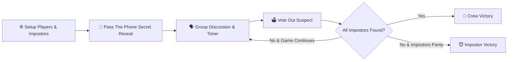

# 🕵️‍♂️ Who Is The Imposter?

<p align="center">
  
</p>

<p align="center">
  <strong>The ultimate pass-the-phone party social deduction game built for groups, gatherings, and game nights!</strong>
</p>

<p align="center">
  <a href="https://who-is-the-imposter-pi.vercel.app" target="_blank">
    
  </a>
  
  
  
  
</p>

---

## 🎮 Overview

**Who Is The Imposter?** is an engaging, offline-first, pass-the-phone multiplayer party game. Players sit together in a room with a single smartphone or tablet. 

- **Innocent Crewmates** receive the secret round word along with a matching image.
- **Hidden Impostors** receive **one unique, natural, balanced hint** that gives them just enough clue to blend into conversation without giving the answer away!
- Players then take turns discussing, asking subtle questions, and voting out the suspects.

---

## ✨ Key Features

- **📱 Single-Device Pass-and-Play**: No individual apps or downloads required for every player—just pass one device around the circle.
- **🧠 Natural & Balanced Clue Engine**:
  - Over 520 curated words across **13 rich categories**.
  - Every word features **4–6 balanced, natural clues** (e.g. for *Coconut*: *"Shell"*, *"Palm tree"*, *"Hard outside"*, *"Inside a shell"*).
  - Multi-impostor uniqueness: Each impostor in a round receives a distinct clue to avoid cross-collusion.
- **🗳️ Streamlined Voting & Instant Role Reveal**:
  - One vote = Instant elimination with distinct role reveal (`🕵️ WAS AN IMPOSTOR!` or `🛡️ WAS A CREWMATE!`).
  - Strict multi-impostor secrecy: Eliminating 1 of multiple impostors confirms their role while keeping alive impostor(s) hidden.
- **🖼️ 100% Offline-Ready Asset Library**: 520+ local optimized high-fidelity images mapped directly to every word.
- **⏱️ Interactive Discussion Timer**: Configurable countdown with real-time audio cues, pausing, and quick-vote overrides.
- **🏆 Persistent Scoring**: Cumulative leaderboards track rounds across your whole game session.
- **🔊 Sound FX & Haptics**: Built-in sound synthesis for taps, timer heartbeats, reveals, and celebrations.

---

## 🗂️ 13 Game Categories (520+ Words)

| Category | Icon | Example Words |
| :--- | :---: | :--- |
| **Animals** | 🐯 | *Tiger, Elephant, Kangaroo, Cheetah, Langur, Buffalo* |
| **Fruits** | 🍎 | *Mango, Coconut, Dragon Fruit, Kiwi, Avocado, Papaya* |
| **Vegetables** | 🥕 | *Carrot, Broccoli, Zucchini, Artichoke, Mushroom* |
| **Food & Dishes** | 🍕 | *Pizza, Biryani, Pasta, Momos, Shawarma, Dosa* |
| **Household Objects** | 🏠 | *Clock, Water Filter, Lock and Key, Toaster, Geyser* |
| **Birds** | 🦅 | *Eagle, Peacock, Flamingo, Kingfisher, Toucan* |
| **Insects** | 🐞 | *Butterfly, Dragonfly, Honeybee, Firefly, Beetle* |
| **Countries** | 🌍 | *Japan, Brazil, Egypt, Iceland, Australia, India* |
| **Cities** | 🏙️ | *Tokyo, Paris, New York City, London, Dubai, Goa* |
| **Sports** | ⚽ | *Football, Basketball, Cricket, Badminton, Tennis* |
| **Professions** | 💼 | *Doctor, Astronaut, Chef, Detective, Pilot, Architect* |
| **Vehicles** | 🚗 | *Airplane, Motorcycle, Helicopter, Submarine, Train* |
| **Movies & Cinema** | 🎬 | *Inception, Interstellar, Titanic, Avengers, Avatar* |

---

## 📖 How to Play



1. **Setup**: Choose number of players (3–20), number of impostors (1–5), timer length, and enabled categories.
2. **Pass The Phone**: Each player is prompted to take the device. Hold to reveal your secret role:
   - *Crewmates* see the secret word and photo.
   - *Impostors* see a subtle, helpful conceptual hint.
3. **Discussion**: Start the timer. Players ask one another creative questions without making their secret knowledge obvious.
4. **Voting**: Tap the player who seemed most suspicious.
5. **Role Reveal & Scoring**: The game immediately reveals whether the eliminated player was an Impostor or a Crewmate, advancing smoothly to the next round.

---

## 🛠️ Tech Stack

- **Framework**: [React 18](https://react.dev/) + [Vite](https://vitejs.dev/)
- **Language**: [TypeScript](https://www.typescriptlang.org/)
- **Styling**: [Tailwind CSS](https://tailwindcss.com/)
- **Icons**: [Lucide React](https://lucide.dev/)
- **Confetti FX**: [canvas-confetti](https://www.npmjs.com/package/canvas-confetti)
- **Deployment**: [Vercel](https://vercel.com/)

---

## 🚀 Quick Start & Local Development

### Prerequisites
- Node.js (v18.0.0 or higher)
- npm, yarn, or pnpm

### 1. Clone the repository
```bash
git clone https://github.com/VivekRay19/who-is-the-imposter.git
cd who-is-the-imposter
```

### 2. Install dependencies
```bash
npm install
```

### 3. Start development server
```bash
npm run dev
```
Open your browser at `http://localhost:5173`.

### 4. Build for production
```bash
npm run build
```

### 5. Validate game dataset integrity
```bash
npm run validate-data
```

---

## 📂 Project Structure

```text
who-is-the-imposter/
├── public/
│   └── images/              # 520+ categorized local image assets
├── scripts/                 # Dataset validation & simulation scripts
│   ├── natural_hints.json   # 520-word balanced hints dataset
│   └── validateData.ts      # Automated asset & data integrity validator
├── src/
│   ├── components/          # Reusable UI components (Timer, WordCard, Buttons, etc.)
│   ├── data/                # Category definitions and word lists
│   ├── game/                # Core game logic, scoring, and Web Audio synthesizers
│   ├── pages/               # Screen views (Home, Setup, PassPhone, Voting, Results)
│   ├── types/               # TypeScript interfaces and game state models
│   ├── App.tsx              # Main state machine and screen controller
│   └── main.tsx             # Application entry point
├── package.json
├── tailwind.config.js
├── tsconfig.json
└── vite.config.ts
```

---

## 🌐 Deployment

This project is optimized for zero-config deployment on [Vercel](https://vercel.com/):

```bash
npx vercel --prod
```

---

## 📄 License

Distributed under the MIT License. See `LICENSE` for more information.
